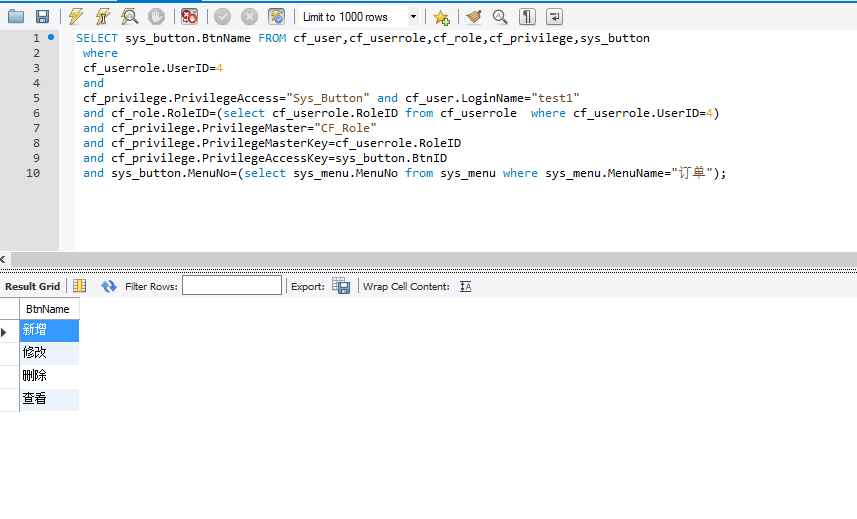

##查看页面

##伪代码
 1、根据用户名称查询用户ID
 2、根据用户ID查对应角色
 3、for每一个角色
 从权限表中查角色对应权限ID
 合并角色的权限集合
 4、判断权限集合是否有查看权限
 5、If有
 输出对应页面
 Else
 不输出
##操作权限

##伪代码
 1、根据用户名称查询用户ID  
 2、根据用户ID查对应角色  
 3、for每一个角色  从权限表中查角色对应权限ID  合并角色的权限集合  
 4、查询权限集合中菜单名为“订单”的数据
 5、输出对应的权限
